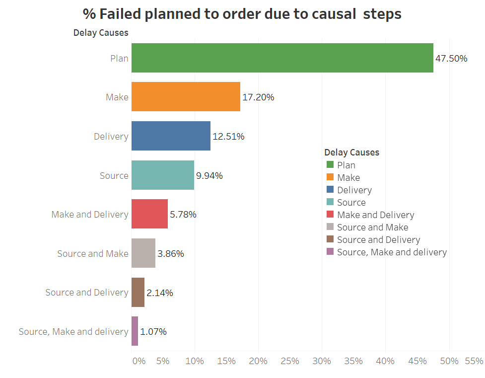
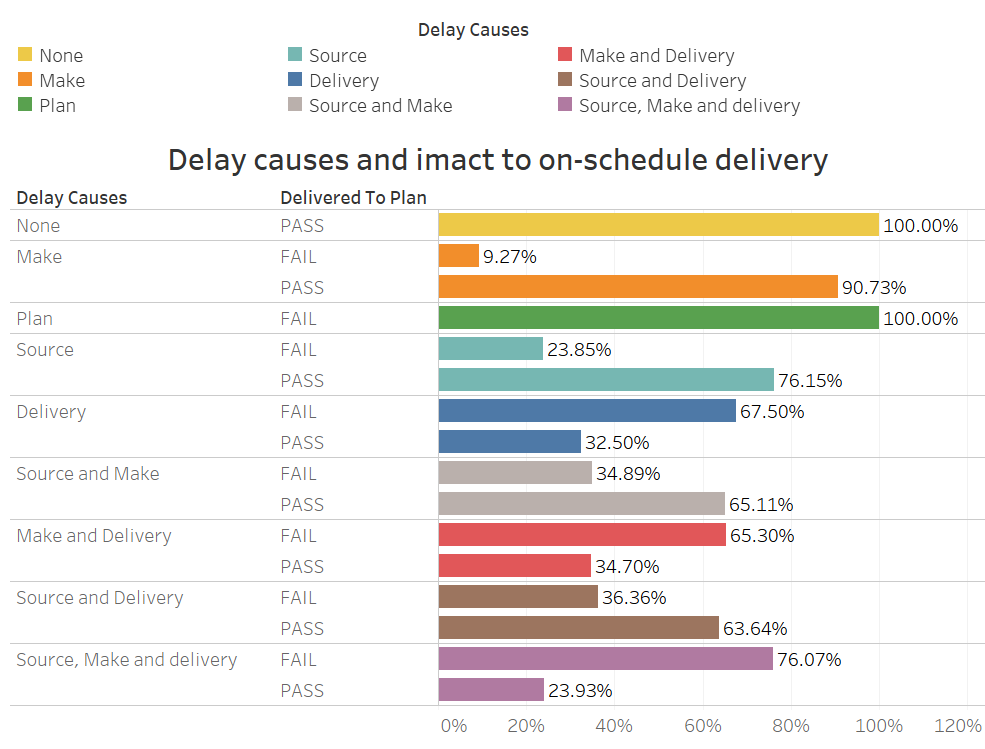
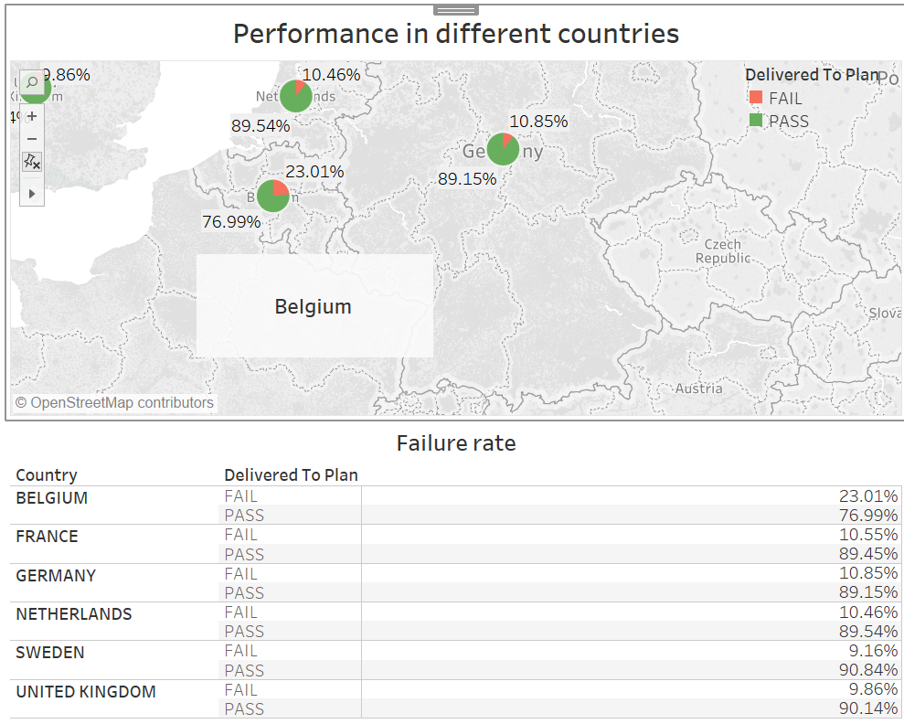
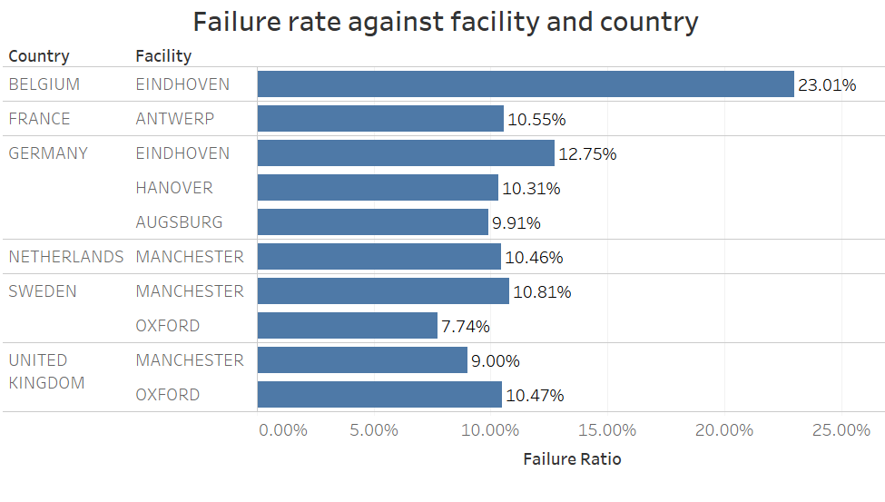
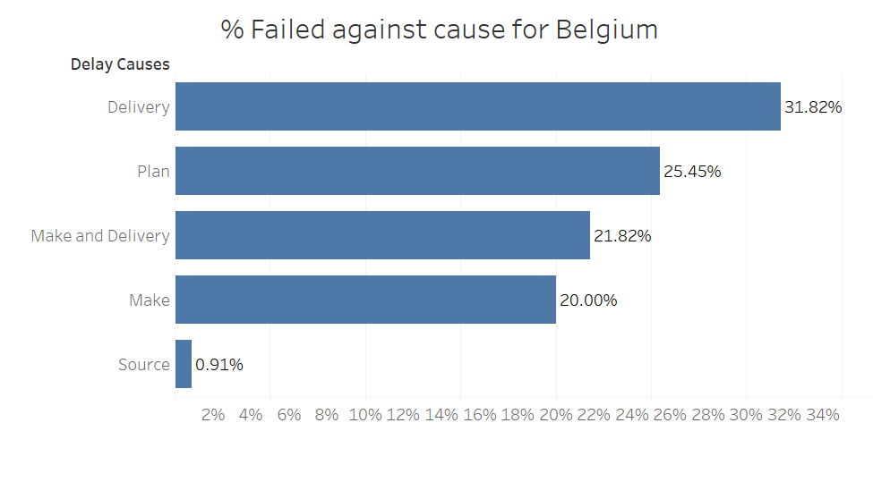

```{r setup, include=FALSE}
knitr::opts_chunk$set(echo = TRUE)
```

```{r include=FALSE}
library(tidyverse)
library(lubridate)
library(readxl)
library(bnlearn)
library(randomForest)
library(rpart)
library(partykit)

```
## Content:
* 1.  Introduction   
* 2.  Problem Statement   
* 3.  Assumptions  
* 4.  Data dictionay  
* 5.  Data Processing   
* 6.  Feature Engineering 
* 7.  Discriptive Analysis   
* 8.  Variable importance analysis using decission trees and Random forest  
* 9.  Bayesian Network Analysis  
* 10. Results
* 11. Conclusion and recommendation

### 1. Introduction:
The following sections deals with advance analytics methods to perform root cause analysis to solve late deliveries problem of The Company. The approach uses descriptive analysis, feature engineering and variable importance to identify the different causes of late deliveries. Bayesian Network is used to identify the possible root cause i.e. from where the problem/problems might have generated. The solution uses advance analytics modelling to analyze the data and find useful patterns to answer the question of possible root cause. 

### 2. Problem Statement
To find the supply chain steps that are major contributors to the delay in delivery and use modelling techniques to find the association they might have with the other variables. The association or relationship between variables will help to find the root cause of late deliveries problem. A special case of Belgium that has heighest failed planned delivery rate is explained through the analysis performed by analytical models.  

### 3. Assumptions:
a. The deadlines mentioned in the dataset for each step is expected time period between the completion of this step and the previous step.  
b. Expected pickup time for an order (different from the time when order is ready) is datetime_ordered + deadline_source +  deadline_make. It is also different accross different facilities. 
c. The actual pickup datetime of an order is equal to the expected pickup time when make step is finished before expected pickup time else it is 24 hours + expected pickup time for a given facility.  
d. If the order failed to delivered as planned and steps from make to delivery met the deadlines then plan step is at fault.  
e. Country in the data set is country of origin of the order i.e. the order is placed from this country and delivery will be made in this country.


### 4. Data dictionary
a. datetime_expected_pickup: Is expected pickup time calculated as datetime_ordered + deadline_source*60 + deadline_make*60*60  
b. deadline_source_secs    : deadline_source in secs  
c. deadline_make_secs      : deadline_make in secs  
d. deadline_deliver_secs   : deadline_deliver in secs  
e. datetime_actual_pickup  : As per assumption this is datetime_expected_pickup if datetime_expected_pickup greater than datetime_product_ready else datetime_expected_pickup + 24*60*60 secs  
f. order_to_source         : time in secs between order places and order sourced  
g. source_to_make          : time in secs between order sourced and order ready  
h. make_to_delivey         : time in secs between order ready and order delivered  
i. is_source_delay         : a flag that is 1 when source step does not met the deadline else 0  
j. is_make_delay           : a flag that is 1 when make step does not met the deadline else 0  
k. is_delivery_delay       : a flag that is 1 when delivery step does not met the deadline else 0  
l. is_plan_delay           : a flag that is 1 when bad plan resulted in delay else 0. If make to delivery steps in supply chain met their deadlines but the order is failed planned delivery then this flag is 1.  


### 5. Data Processing

a. Read data file into data frame and perform data cleaning  
```{r warning=FALSE}
df.main <- read_excel("CASE STUDY_DATA_LATE DELIVERY ROOT CAUSE.xlsx", sheet = "output")
```

b. Check the format of the data in the data frame  

```{r}

str(df.main)

```

c. Create a copy of the data frame for Processing  
````{r}
df.processing <- df.main
```

d. Perform the data processing  
```{r}
### Calculation of expexted datetime pickup 
### Expected datetime pickup = datetime_ordered + deladline_source + deadline_make
### All the deadlines are converted to seconds
df.processing$datetime_expected_pickup <- df.processing$datetime_ordered + (df.processing$deadline_source*60 +  df.processing$deadline_make*60*60)

### Convert the character types to factors
df.processing$order_id <- as.factor(df.main$order_id)
df.processing$country <- as.factor(df.main$country)
df.processing$shipping_method <- as.factor(df.main$shipping_method)
df.processing$facility <- as.factor(df.main$facility)
df.processing$product_category <- as.factor(df.main$product_category)
df.processing$on_sale <- as.factor(df.main$on_sale)
df.processing$returned <- as.factor(df.main$returned)
df.processing$backorder <- as.factor(df.main$backorder)
df.processing$delivered_to_plan <- as.factor(df.main$delivered_to_plan)

### Convert all deadlines into seconds
df.processing$deadline_source_secs <- df.processing$deadline_source*60
df.processing$deadline_make_secs <- df.processing$deadline_make*60*60
df.processing$deadline_deliver_secs <- df.processing$deadline_deliver*60*60*24
```

e. Calculate actual pickup time  

```{r}

### Calcultaing actual pickup time
### If order is ready before expected pickup time then actual pickup time is expected pickup time
### If order is redy after expected pickup time then actual pickup time is expected pickup time + 24hours
df.processing$datetime_actual_pickup <- dplyr::if_else(df.processing$datetime_expected_pickup > df.processing$datetime_product_ready, df.processing$datetime_expected_pickup, df.processing$datetime_expected_pickup + 24*60*60)
```

### 6. Feature Engineering  
Creating features to check which step resulted in the delay in delivery of order.   
Delay for each step is measured as time the step performed - the time when previous step is finished.    
```{r}

### order_to_source: This column represents the amount of time taken is seconds from order been placed to the order sourced for make step. It is total time for sourcing an order
df.processing$order_to_source <- as.numeric(df.processing$datetime_sourced - df.processing$datetime_ordered, units = "secs")
### source_to_make: This column represents the amount of time take in seconds from order been sourced to the order been ready for delivery. It is total time for making an order.
df.processing$source_to_make <- as.numeric(df.processing$datetime_product_ready - df.processing$datetime_sourced, units = "secs")
### make_to_delivery: This column represents the amount of time take in seconds from order been made to the order been delivered. It is total time for delivering an order.
df.processing$make_to_delivey <- as.numeric(df.processing$datetime_delivered - df.processing$datetime_actual_pickup, units = "secs")

### is_source_delay: This column represents if the source step was delay or not by comparing it with source deadline
df.processing$is_source_delay <- as.numeric(df.processing$order_to_source > df.processing$deadline_source_secs)

### is_make_delay: This column represents if the make step was delay or not by comparing it with make deadline
df.processing$is_make_delay <- as.numeric(df.processing$source_to_make > df.processing$deadline_make_secs)

### is_delivery_delay: This column represents if the delivery step was delay or not by comparing it with delvery deadline
df.processing$is_delivery_delay <- as.numeric(df.processing$make_to_delivey > df.processing$deadline_deliver_secs)

### is_plan_delay: This column represents if the plan step was delayed or not. If there was no delay in source, make and deliver steps and order failed to get delivered on time then the delay is because of plan step
df.processing$is_plan_delay <- as.numeric(!(df.processing$is_source_delay | df.processing$is_make_delay | df.processing$is_delivery_delay) & (df.processing $delivered_to_plan == "FAIL"))

### converting all the is_[cause]_delay variables to factor
df.processing$is_source_delay <- as.factor(df.processing$is_source_delay)
df.processing$is_make_delay <- as.factor(df.processing$is_make_delay)
df.processing$is_delivery_delay <- as.factor(df.processing$is_delivery_delay)
df.processing$is_plan_delay <- as.factor(df.processing$is_plan_delay)
```

### 7. Discriptive Analysis
The desciptive analysis helped to scope the problem of identifying steps that are major factors in failed planned delivery. Based on this analysis, further model was built to find the root cause. 

The below descriptive analysis is performed on Tableau. I choose Tableau because it is fast for intial data exploration. A tableau packaged workbook is present in the same zip folder as this file. 



The figure show out of all the failed planned delivery, what all steps or combination of them that did not met their deadline and contributed to what percentage to overall number of delays. 

* As we can see from the above figure that the bad Plan resulted in most number of delays in delivery of order. This means 47.50% of the failed planned delivery is caused because of bad plan even if rest of steps met their deadlines.  

* Also, from the above graph we can interpret that 17.20% failed planned delivery is associated with Make step given all other steps met the deadline. 

* The next important step is delivery. If it did not meet its deadline even if rest of steps does, can result in 12.51% of failed planned delivery.  

* We can only observe contribution of these step towards the failed planned delivery. But what about those delivery that were passed?  

* This can be answered through below graph:  


* As we can see from the above graph that bad plan contributes to 100% of the failed planned delivery and there is no passed planned delivery for it. This is not an anomaly or a significant factor since we have assumed that when source, make or delivery steps meet their deadline then plan is the factor for delay. 
The important point to consider in this graph is that if delivery step does not meet its deadline then 67.50% of the orders are delayed and only 32.50% of orders are delivered on time. Similary, the case for combined steps of make and delivery and source, make and delivery. Delivery is common in all three and thus it is another major factor. 

We can further check how the performance is against different countries. 


* We can see from the above map that 23.01% of orders are failed planned delivery and 76.99% are passed planned delivery for Belgium. And thus Belgium has the highest rate of failed planned delivery even doubled than other countries. So what can be the issue with Belgium?  

* Let us check another graph which can drill down to the problem in Belgium. Does a particular facility serves Belgium? How is the performance of that facility? These questions are explained from below graph:



** (Failure rate or Failure ratio is the number of oders failed against total number of orders.) **


As we can see from the above graph that the failure ratio is high for the country Belgium and facility Eindhoven. Also, faliure rate for country Germany and facility Eindhoven is the second largest. This does gives some insight about what could possible causes of failed planned deliveries. 

* Another graph that explains Belgium case, is as below. It tell what all percentage of failed planned delivery is explained by which supply chain steps.  


* We can see from the above graph that delay in delivery step is major issue for Belgium that contributed to 31.82% of all failed planned deliveries. 


From overall descriptive analysis we come up with a hypothesis that there is some problem in delivery from these facility to the countries and with Belgium. Also, bad plan can be a major factor for failed planned deliveries.  

Let's develop some models to support these hypothesis. 

### 8. Variable importance analysis using decission trees and Random forest 

* Let's develop the decision tree and then random forest model to check which variable can explain large number of failed planned delivery.   

* I am ignoring the date variables, order ids, returned, backorder, deadlines and calculated delays. Returned order and backorder are removed for large number of null values which does not provide useful insights. Dates and deadlines are already used to calculate is_[cause]_delay i.e. is_source_delay, is_make_delay, is_delivery_delay or is_plan_delay, so are also ignored.  


```{r}

model.data <- df.processing

model.data <- select(df.processing, country, shipping_method,units_per_order, facility, product_category, on_sale, transit_days,is_source_delay, is_make_delay, is_delivery_delay, is_plan_delay, delivered_to_plan)
set.seed(100)
indx <- sample(1:nrow(model.data), size = 0.8*nrow(model.data))
data.train <- model.data[indx,]
data.test <- model.data[-indx, ]
```

#### a. Decision tree model

```{r}
dctree.model <- rpart(delivered_to_plan~., data = data.train)
plot(as.party(dctree.model))
```

* As we can see from the above plot that the decision tree model considers is_plan_delay and is_delivery_delays as two important variable.  

Now, we can check random forest model also for finding important variables.

#### b. Random forest model 
```{r}
## Creating the random forest model. For calssification problems random forest has mtry = sqrt(number of predictors)
mtry.rf <- sqrt(dim(data.train)[2])

## Model fitting
rf.model <- randomForest(data.train$delivered_to_plan~., data = data.train, mtry = mtry.rf, importance = TRUE)
## Model summary
rf.model
```

** The summary of the rf.model shows that it has 4.13% out of bag error. Which is pretty good. ** 
* We can check the train accuracy as below:
```{r}
mean(data.train$delivered_to_plan == rf.model$predicted)
```
* The train accuracy is 95.86%. 

* We can also check accuracy on test data. 

```{r}
test.pred.delivered_to_plan <- predict(rf.model, data.test)
test.actual.delivered_to_pal <- data.test$delivered_to_plan
table(test.actual.delivered_to_pal, test.pred.delivered_to_plan)
```

```{r}
mean(test.actual.delivered_to_pal == test.pred.delivered_to_plan)
```
* The test accuracy of 96% represent a good fit. The test accuracy is higher than train accuracy, it means that the model generalizes really well. The above process was required to check if the model show right sets of impotant variables.

* Let us plot varriable importance. 

```{r}
varImpPlot(rf.model)
```

** Now we know that bad plan and delay in delivery step are two major factor that is contributing to the failed planned delivery. But are they root cause? This can only be determined if we find the relationship between the different variables. For finding the relationship between variables we need probablistic graphical model. 
We will now use structure learning for  Bayesian Network. I will use score based method with hill climbing algorithm. This is a greedy algorithm and will work for our interpretation. 

### 9.  Bayesian Network Analysis

```{r}
graph.model <- hc(model.data)
plot(graph.model)

```
  
* From above Bayesian Network we can see that country is the root node and other variables are conditionally dependent on it. But does it alone make any sense of the root cause?  

* We need to further check in the network the relationships that can create failed delivered_to_plan.  

* Prior to that we should remove any unwanted connection that are not intutively correct. For example on_sale should not have any impact on is_delivery_delay. Similarly shipping_method should not impact make_delay. 

* Further, we will add the constraints that plan is followed by source, source is followed by make and make is followed by delivery. 
So we need to remove links that do not follow this pattern.

```{r}
graph.model$arcs <- graph.model$arcs[-which((graph.model$arcs[,'from'] == "on_sale" & graph.model$arcs[,'to'] == "is_delivery_delay")),]
graph.model$arcs <- graph.model$arcs[-which((graph.model$arcs[,'from'] == "shipping_method" & graph.model$arcs[,'to'] == "is_make_delay")),]
graph.model$arcs <- graph.model$arcs[-which((graph.model$arcs[,'from'] == "is_source_delay" & graph.model$arcs[,'to'] == "is_plan_delay")),]
graph.model$arcs <- graph.model$arcs[-which((graph.model$arcs[,'from'] == "is_make_delay" & graph.model$arcs[,'to'] == "is_plan_delay")),]
graph.model$arcs <- graph.model$arcs[-which((graph.model$arcs[,'from'] == "is_make_delay" & graph.model$arcs[,'to'] == "is_source_delay")),]
graph.model$arcs <- graph.model$arcs[-which((graph.model$arcs[,'from'] == "is_delivery_delay" & graph.model$arcs[,'to'] == "is_source_delay")),]
plot(graph.model)

```
  
* From the above network diagram we can see that country and facility are two major nodes that are affecting delays. Also, facility is conditional upon country and product category. 


### 10. Results: 

* From desciptive analysis and through the varaible importance analysis we can say that bad plan is major factor in over all failed planned delivery. 

* From the descriptive analysis of "% Failed planned to order due to causal steps" we interpret that Make step is the second most important factor such 17.2% of all failed planned deliveries was associated with delay in make step. 

* From "Delay causes and imact to on-schedule delivery" we interpret that though make step seems second most important factor but if we check % of order failed and passed because of the delay in a particular step or combination of steps then it seems that if delivery does not meets its deadline then out of all orders 67.50% of the orders are failed planned deliveries and 32.50% are passed.  

* From "Performance in different countries" we interpret that Belgium has 23.01% of failed planned delivery in comparision to 76.99% of passed planned delivery. This failed planned rate is double than other countries.  

* From "Failure rate against facility and country" we interpret that Belgium is served by only one facility which is Eindhoven. Eindhoven also serves Germany and failure rate is high for facility in Eindhoven. 
Note:- Failure rate is (# of failed planned delivered)/ (# of total order delivered)

* From "Failed against cause for Belgium" we can interpret that out of all failed planned delivery in Belgium 31.82% were when only the Delivery step did not met its deadline and rest steps does. This show delivery is a problem in Belgium.

* From Decision Tree and Random forest model we interepret that delay in plan and delivery are two important variable that explains overall failed planned delivery.

* Bayesian Network provides the relationship between various variables and identify which variable is conditionaly dependent on other. 
Considering all above analysis, we see three major issues: 
1. Delay in plan  
2. Delay in delivery  
3. Delay in make  

* Belgium is most affected by delay in delivery. 

These issues are not the root cause but the sub causes, the root of these issue is found using Bayesian Network. 
We can see that country is the root of this network. Country also directly affects deliver delay. While delay in plan is directly affected by facility. Delay in make is affected by both Country and facility. 
Facility itself is affected by country and product category.  


### 11. Conclusion and Recommendation:  
From above analysis we can conclude that failed planned delivery issue of The Company is majorly impacted by bad Plan. The second important factor that impact failed planned delivery is delivery step not meeting deadline. The third important factor that impact failed planned delivery is make step does not meet deadline. Belgium is primarily affected by delivery step not meeting deadline. 
As per Bayesian network, the cause of these step not meeting deadline is relationship between Country, facility, product categories and supply chain steps. 
Considering these important peices of information an important conclusion can be drawn that the planning of orders from which country for what product category will be handled by which facility is not optimized. Considering the case of Belgium, the order for Belgium is served by Eindhoven which is located in Neitherland even if Antwerp (city in Belgium) has the facility. This can also be the reason for delivery step not meeting its deadline.
On the basis of above analysis, my recommendation is to optimize the planning process that should send the order request of a country to its own facility or the nearest facility. 


